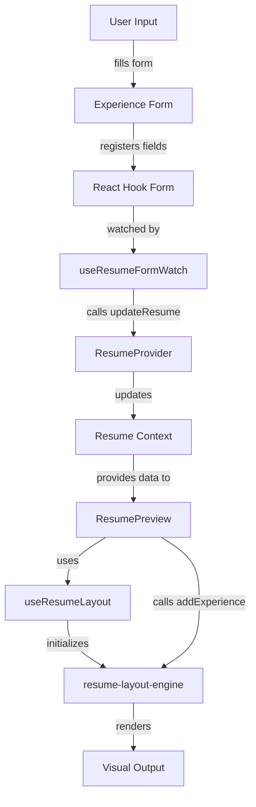

# Experience Form + Resume Preview Implementation Summary

## Overview
Successfully implemented a complete Experience form with all fields and integrated the `resume-layout-engine` package for real-time resume preview rendering.

## What Was Implemented

### 1. Package Installation ✅
- Installed `resume-layout-engine` v1.0.0
- Package added to dependencies in `package.json`

### 2. Resume Layout Hook ✅
**File:** `hooks/useResumeLayout.ts`

Created a custom React hook that wraps the resume-layout-engine API:
- Manages the layout engine instance lifecycle
- Returns containerRef for DOM attachment
- Provides engine, pageCount, and remainingSpace state
- Handles cleanup on unmount
- Accepts template configuration for styling

### 3. Complete Experience Form ✅
**File:** `components/EditorSections/Experience.tsx`

Built a fully-featured experience form with:
- **Job Title** - Input field for position name
- **Company** - Input field for company name
- **Description** - Textarea for job responsibilities
- **Start Date** - Month and year selectors
- **End Date** - Month and year selectors (hidden when "currently working here")
- **Toggle Fields:**
  - "I currently work here" - Marks position as present
  - "Show dates" - Controls date visibility
  - "Visible on resume" - Controls section visibility
  - "This is an internship" - Marks position as internship
- **Add/Remove Experience** - Dynamic array management
- **Form Validation** - Uses Zod schema with date validation

**Key Features:**
- Uses react-hook-form with useFieldArray for dynamic entries
- Integrates with existing UI components (EditorField, Item, etc.)
- Follows the same pattern as PersonalDetails section
- Year dropdown generates years from 1970 to current year + 2
- Month dropdown uses existing months constant
- Each experience item is collapsible with visibility toggle
- Remove button for deleting experience entries

### 4. Resume Preview Integration ✅
**File:** `components/ResumePreview/ResumePreview.tsx`

Updated the preview component to:
- Use the `useResumeLayout` hook
- Subscribe to resume data from ResumeProvider
- Render experiences using `engine.addExperience()`
- Display page count and remaining space statistics
- Clear and re-render on data changes
- Filter out invisible experiences before rendering
- Maintain the existing A4 paper styling

### 5. Data Flow Connection ✅
The data flow is fully connected through existing infrastructure:

```
Experience Form (user input)
    ↓
React Hook Form (form state)
    ↓
useResumeFormWatch (watches changes)
    ↓
ResumeProvider.updateResume() (debounced)
    ↓
Resume Context (global state)
    ↓
ResumePreview (subscribes to changes)
    ↓
resume-layout-engine (renders preview)
    ↓
Visual Preview (updates in real-time)
```

**Key Points:**
- Form updates trigger automatic preview updates
- Updates are debounced (500ms) to prevent excessive re-renders
- The `useResumeFormWatch` hook handles experience field changes
- No manual synchronization needed - works out of the box

## Architecture



## Files Modified

1. **package.json** - Added resume-layout-engine dependency
2. **hooks/useResumeLayout.ts** - Created new hook
3. **components/EditorSections/Experience.tsx** - Complete form implementation
4. **components/ResumePreview/ResumePreview.tsx** - Preview integration

## Files Referenced (Not Modified)

- `hooks/useResumeFormWatch.ts` - Already handles experience changes
- `context/ResumeProvider.tsx` - Already provides context and debouncing
- `lib/utils/schemas.ts` - Already has experience schema defined
- `lib/utils/types.ts` - Already has ExperienceItem interface

## Testing Instructions

1. **Start the development server:**
   ```bash
   pnpm run dev
   ```

2. **Open the application:**
   - Navigate to `http://localhost:3000`
   - The editor panel is on the right
   - The preview panel is on the left (hidden on mobile)

3. **Test the Experience Form:**
   - Click on "Experience" in the editor navigation
   - Click "Add Experience" button
   - Fill in job title, company, dates, and description
   - Toggle switches to test visibility/present/internship options
   - Add multiple experiences
   - Remove experiences using the trash icon

4. **Verify Preview Integration:**
   - Check that experiences appear in the preview
   - Verify page count and remaining space statistics update
   - Confirm that changes in the form update the preview
   - Test that invisible experiences don't appear in preview
   - Verify debounced updates (changes should apply after 500ms)

## Technical Highlights

- **Type Safety**: Full TypeScript support with proper types
- **Form Management**: Uses react-hook-form for optimal performance
- **State Management**: Leverages existing context infrastructure
- **Debouncing**: Automatic debouncing prevents excessive updates
- **Validation**: Zod schema ensures data integrity
- **Responsive**: Works on desktop and mobile layouts
- **Maintainable**: Follows existing code patterns and conventions

## Known Considerations

1. The `resume-layout-engine` package API may vary - the implementation uses a generic approach that handles common methods
2. The engine is initialized with basic styling (Arial, 12px) - can be customized in the hook call
3. Clear functionality checks if `engine.clear()` exists before calling
4. Event listeners check if `engine.on/off()` exist before using
5. All engine method calls are wrapped in type checks for robustness

## Next Steps (Optional Enhancements)

1. Add personal details (name, email, phone) to preview
2. Add education section form and preview integration
3. Add skills section form and preview integration
4. Add custom section support
5. Add template/styling options for the preview
6. Add PDF export functionality
7. Add print support
8. Add page break controls
9. Add section reordering
10. Add preview zoom controls

